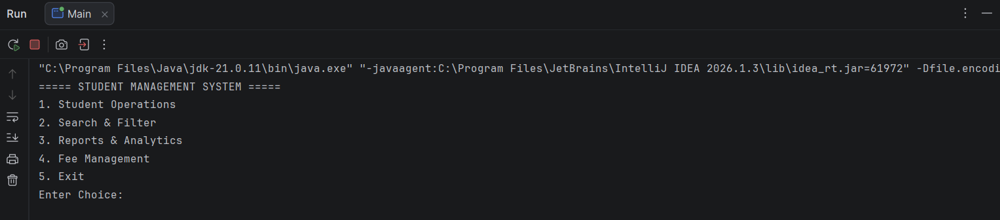
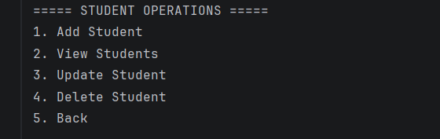
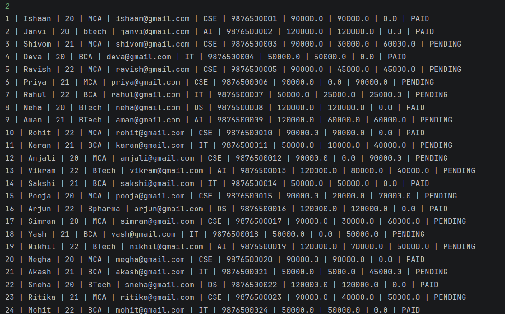
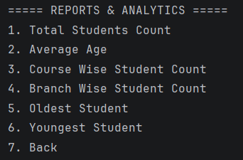
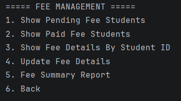
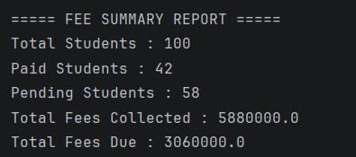

# Student Management System

A console-based Student Management System developed using Java, JDBC, MySQL, and Maven.

## Features

### Student Management
- Add Student
- View All Students
- Update Student Details
- Delete Student
- Search Student by ID
- Search Student by Name
- Search Student by Course
- Search Student by Mobile Number

### Sorting
- Sort Students by Name
- Sort Students by Age

### Reports & Analytics
- Total Students Count
- Average Age
- Course Wise Student Count
- Branch Wise Student Count
- Oldest Student
- Youngest Student

### Fee Management
- Show Pending Fee Students
- Show Paid Fee Students
- Show Fee Details By Student ID
- Update Fee Details
- Fee Summary Report

## Technologies Used

- Java
- JDBC
- MySQL
- Maven
- IntelliJ IDEA

## Validations Implemented

- Name Validation
- Age Validation
- Email Validation
- Mobile Number Validation
- Course Validation
- Branch Validation
- Fee Validation

## Database

MySQL database stores student information, fee details, and reports.

## Screenshots

### Main Menu

### Student Operation Menu

### View Students

### Reports & Analytics

### Fee Management

### Fee Summary Report

## Author

Ishaan Bhatnagar
B.Tech Information Technology